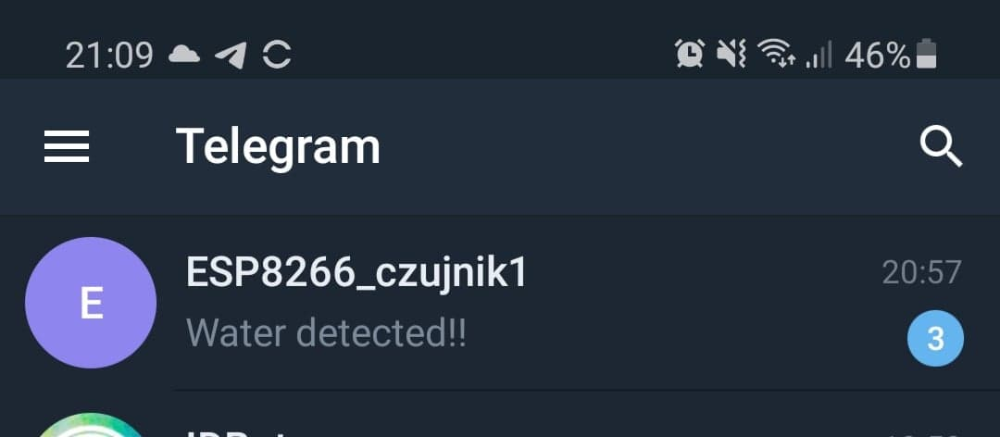
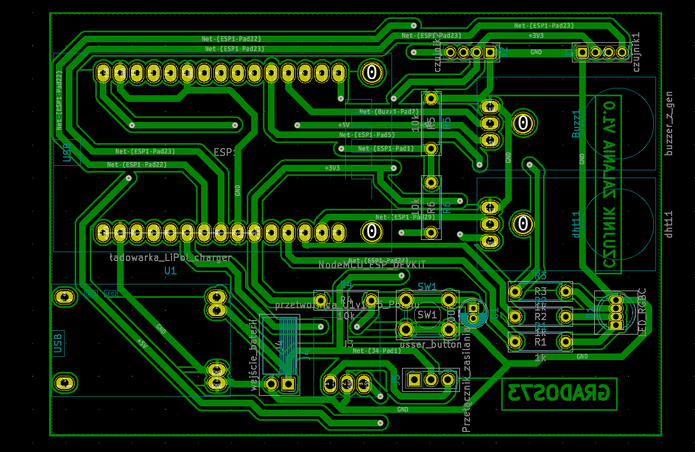
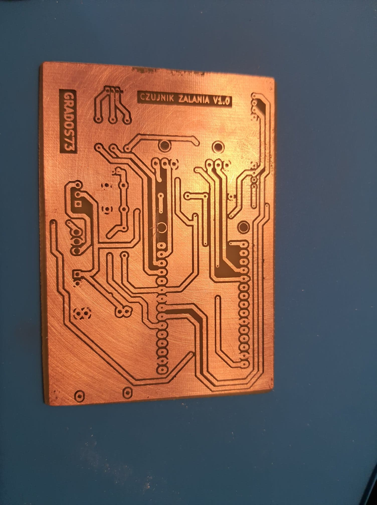

# Project Name
> Water ESP Sensor

## Table of contents
* [General info](#general-info)
* [Screenshots](#screenshots)
* [Technologies](#technologies)
* [Features](#features)
* [Status](#status)
* [Inspiration](#inspiration)
* [Contact](#contact)

## General info
When I put the almost 600l aquarium in my flat, my wife was afraid of flooding the apartment. To calm her down I designed, programmed and made my own PCB with ESP8266.
The device, if it detects water on any of the two connected sensors, sends messages via a Telegram app and generate sound signal.

## Screenshots

## Technologies
C,
Arduino IDE.

## Features
-Send message via a Telegram when detect water,
-When asked, he replies informing us about the temperature, air humidity and battery voltage.

To-do list:
* Low battery level alarm.

## Status
It is working, maybe someday I will do v.1.1.

## Inspiration
Commercial devices are expensive or have limited features.

## Contact
Created by https://www.linkedin.com/in/kamil-gradowski-8706991aa - feel free to contact me!
grados73
